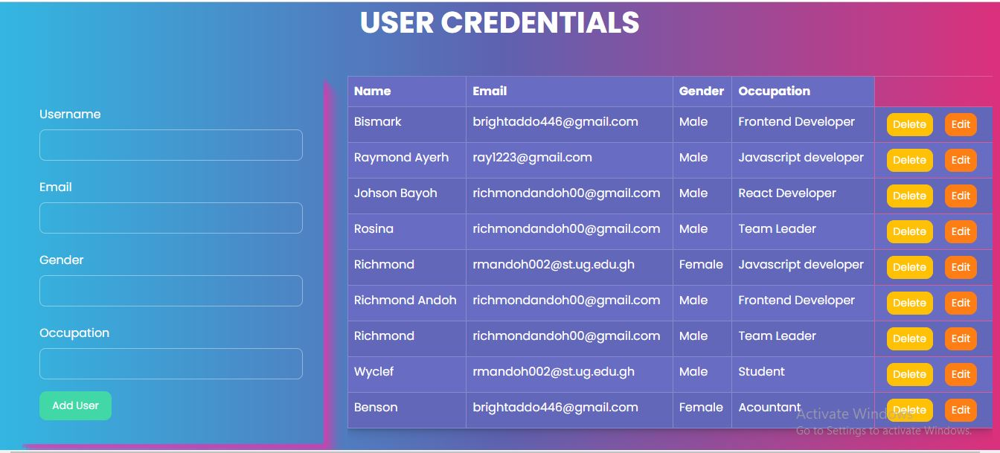

# crud-application
This is a javascript crud application that renders user information to the UI. The rendering comes with delete and edit button for deleting and updating user.

## Overview

The CRUD Application is a simple web application built in JavaScript that allows users to Create, Read, Update, and Delete user data. It provides a user-friendly interface for managing a list of users, and it utilizes local storage to persist user data across page reloads.

## Features

### Create User:

Users can input their name, email, gender, and occupation in the form provided.
Clicking the "Add" button adds the user to the list of users displayed on the page.

### Read User:

The list of users is displayed on the page, showing their name, email, gender, and occupation.
User data is retrieved from local storage and displayed on page load.

### Update User:

Users can edit user details by clicking the "Edit" button next to a user's information.
The user's details are pre-filled in the form, allowing for easy editing.
Clicking the "Add" button after editing updates the user's information.

### Delete User:

Users can delete a user by clicking the "Delete" button next to a user's information.
The deleted user is removed from the list of users.

### Data Persistence:

User data is stored in local storage, ensuring that data is not lost when the page is refreshed.

## How to Use
#### Adding a User:

Enter the user's name, email, select the gender, and enter the occupation in the input fields.
Click the "Add" button to add the user to the list.

### Editing a User:

To edit a user's information, click the "Edit" button next to the user you want to edit.
The user's details will be populated in the input fields for editing.
Make the necessary changes and click the "Add" button to save the changes.

### Deleting a User:

To delete a user, click the "Delete" button next to the user's information.
The user will be removed from the list.

### Data Persistence:

User data is automatically saved in local storage.
Data is retrieved from local storage on page load, ensuring that user data is not lost.

## Troubleshooting
 <li>If you encounter issues with data not persisting, ensure that your browser supports local storage and that it is enabled.</li>
 <li>Clearing browser data (including local storage) may result in data loss.</li>

## Technology Stack
<ul>
 <li>HTML</li>
 <li>CSS</li>
 <li>JAVASCRIPT</li>
</ul>

## Known Limitations

Local storage has a size limitation (typically 5-10MB per domain), so the application may not be suitable for managing very large datasets.
Data is stored on the user's device, making it accessible to anyone with access to that device.

## Future Enhancements

Implement user authentication for more secure data management.
Add validation and error handling for user inputs.
Enhance the user interface with better styling and responsiveness.

## Feedback and Contributions

We welcome your feedback and contributions to improve this CRUD application.

<on>Feel free to report issues, suggest enhancements, or submit pull requests on my GitHub repository.

